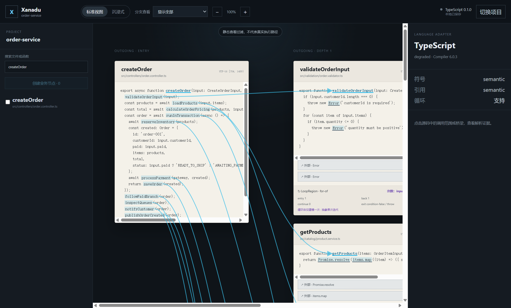
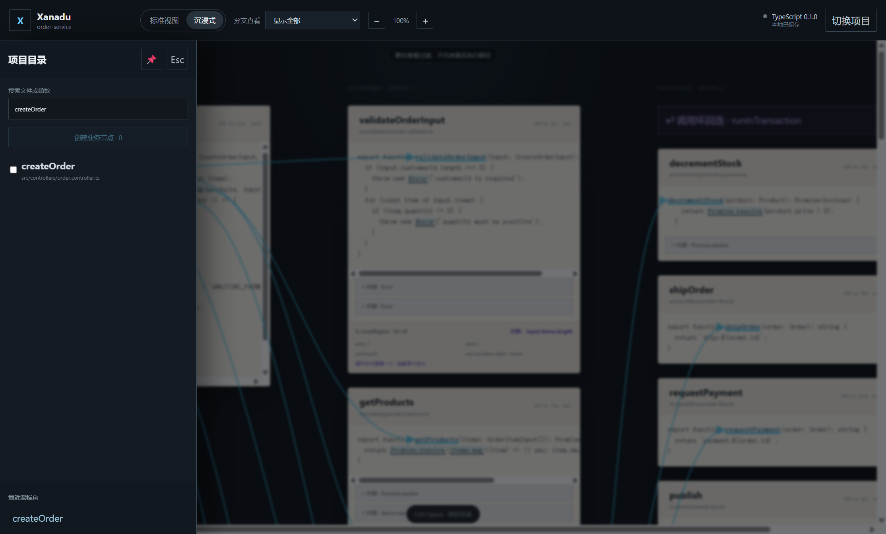

# Xanadu Code Flow Browser

Xanadu Code Flow Browser 是一个本地优先的静态代码阅读桌面应用。它从用户选择的入口函数出发，只沿出站调用展开，把真实源码片段组织为连续 FlowPage，并用 SVG 桥梁连接具体调用范围与具体目标定义范围。

MVP 0.1 已覆盖项目选择、内置 TypeScript 规则、索引、标准/沉浸视图、来源往返、静态分支过滤、LoopRegion、BusinessNode 和重启恢复。它不会上传源码，也不包含断点、变量值、真实执行路径、线程、进程或时间线调试。

## 环境要求

- Node.js 22.12.0 或更新版本；验证基线为 Node.js 24。
- npm 11；仓库提交并使用 `package-lock.json`。
- Windows、macOS 或带图形会话的 Linux。Linux CI 使用 `xvfb-run` 执行 Electron smoke。

## 安装与开发启动

从 clean checkout 执行：

```powershell
npm ci
npm run dev
```

`npm run dev` 会构建 Electron main/preload/utility 入口，启动 Vite renderer，然后启动桌面窗口。用户通过原生目录选择器授权项目；renderer 只收到 opaque workspace handle 和项目显示名。

## 生产构建与本地启动

```powershell
npm run build
npm run start
```

`npm run build` 生成 `dist/` React renderer 和 `dist-electron/` Electron main、单文件 sandbox preload bundle、utility indexer。`npm run start` 会重新构建并运行生产资源；构建产物被 `.gitignore` 排除。

## 质量门禁

```powershell
npm run lint
npm run typecheck
npm test
npm run build
npm run test:e2e
npm run license:check
```

- `npm test` 覆盖领域模型、adapter contract、TypeScript Program/TypeChecker、精确范围、解析状态、outgoing-only、分支、五类循环、递归/调用环、桥梁几何、BusinessNode、持久化和主要组件交互。
- `npm run test:e2e` 需要先执行 `npm run build`。它启动真实 Electron 应用，走完 fixture 授权、utility 索引、FlowPage、来源往返、分支、循环折叠、BusinessNode、沉浸抽屉和重启恢复。
- `npm run license:check` 审核 lockfile 中每个包的许可证字段；新许可证必须显式评审后才能进入 allowlist。

GitHub Actions 对 Pull Request 和 `main` push 运行 install、lint、strict typecheck、unit/component tests、build、Electron E2E 与许可证门禁。

## MVP 演示

正常演示可在应用中选择 [`fixtures/order-service`](fixtures/order-service)。也可以在本地明确授权该 fixture，跳过自动化中的原生目录对话框：

```powershell
$env:XANADU_DEMO_WORKSPACE = (Resolve-Path .\fixtures\order-service).Path
npm run start
```

建议验收顺序：

1. 选择 `order-service`，确认 TypeScript manifest、Compiler 版本、能力和 degraded/healthy 状态可见；fixture 的故意语法错误会产生可恢复诊断。
2. 搜索并打开 `createOrder`。标准视图以源码卡为主体，只沿出站调用展开，未加入 `unrelatedInboundCaller`。
3. 点击调用范围或桥梁查看 resolved/ambiguous/unresolved/external 状态与 TypeChecker 证据。
4. 点击函数标题进入原文件精确范围，再返回 FlowPage。
5. 在“分支查看”选择 A 或 B；另一支变暗、显示隐藏数量，页面明确说明这不是实际运行路径。
6. 展开/折叠 LoopRegion，检查 for/while/do-while/for-of/for-in、entry/back/exit、break/continue/return/throw 和三类静态次数文案。
7. 多选 `createOrder`、`validateOrderInput`、`reserveInventory`、`saveOrder`，创建“创建订单” BusinessNode。
8. 切换沉浸式视图，用 Ctrl+Space 打开覆盖画布的目录抽屉、Esc 关闭、图钉返回标准常驻目录。
9. 关闭并重新启动应用，重新选择同一项目，确认 mode、viewport、分支、循环折叠和 BusinessNode 恢复。

## 实际运行截图

标准视图：



沉浸式视图与覆盖式项目抽屉：



截图由 `npm run screenshots` 启动真实 Electron 应用、索引 fixture 后生成，不使用静态产品数据。

## 架构与安全边界

- main 管理窗口、原生目录授权、workspace handle、utility process 和 userData。
- preload 被打成单一 CJS bundle，在 sandbox 中只暴露按用例命名的 API；不暴露通用 `send`/`invoke`。
- utility process 独占本地文件读取与官方 `@typescript/typescript6` Compiler API/TypeChecker。
- renderer 只消费结构化 DTO；不导入 Node、Electron 或 TypeScript Compiler API，也没有任意文件系统能力。
- SourceAnchor 使用零基 UTF-16 半开区间。绝对路径只存在于受信任进程；UI、索引事实与日志使用项目相对路径。
- 可重建 index cache 与 FlowPage/BusinessNode 用户资产分开保存；清缓存不会删除用户资产。

详细设计见 [架构文档](docs/architecture.md)、[需求映射](docs/requirements-mapping.md)和 [MVP 实施计划](docs/mvp-plan.md)。依赖用途、许可证和风险见 [依赖说明](docs/dependencies.md)。

## MVP 范围限制

- 首版只加载随应用发布的 TypeScript adapter；任意第三方规则包安装、签名和权限模型属于后续阶段。
- 持久化采用 `StoragePort` 后的原子 JSON 实现；SQLite driver 仍需单独完成 Electron ABI/打包验证。
- 静态分析不能声称某次真实运行经过了哪条分支或循环了多少次；真实追踪属于未来运行阶段。
- 项目自身尚未选择开源许可证。分发源码或安装包前，仓库所有者必须确定项目许可证并完成第三方 notices 审阅。
